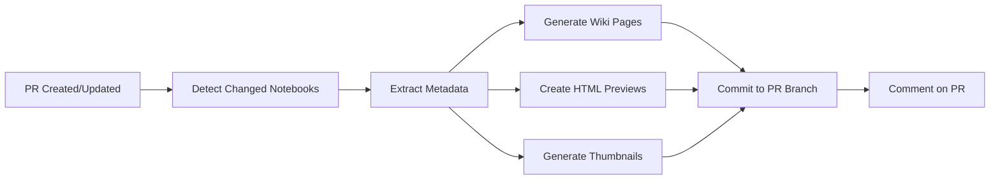

# Auto-Documentation Workflow

This GitHub Action automatically generates wiki pages and preview images for Jupyter notebooks when they are added or modified through pull requests.

## 🎯 What It Does

When you create or update notebooks in a PR, this workflow automatically:

1. **📖 Generates Wiki Pages** - Comprehensive documentation for each notebook
2. **🖼️ Creates HTML Previews** - Rendered outputs without code cells
3. **🎨 Generates Thumbnails** - Preview images for gallery display
4. **💬 Comments on PR** - Summary with links to all generated documentation

## 🚀 How It Works

### Trigger
The workflow runs automatically when:
- A pull request is opened, updated, or reopened
- The PR contains changes to `.ipynb` files

### Process



### Generated Files

For each notebook `example_notebook.ipynb`, the workflow creates:

```
wiki/
  └── example-notebook.md          # Comprehensive wiki page

previews/
  └── html/
      └── example_notebook.html     # HTML preview (outputs only)

thumbnails/
  └── example_notebook.png          # Preview thumbnail
```

## 📝 Wiki Page Contents

Each auto-generated wiki page includes:

- **Overview** - Title, category, author, cell counts
- **Description** - Extracted from notebook metadata
- **Quick Start** - Google Colab and local setup instructions
- **Features** - Category-specific capabilities
- **Requirements** - Python packages and dependencies
- **Usage Examples** - Basic and advanced usage patterns
- **Preview Links** - Links to HTML preview and thumbnail
- **Contributing** - Guidelines for improvements
- **Peer Review** - Review status information
- **Related Resources** - Links to documentation and support

## 🎨 HTML Preview Features

The HTML previews:

- ✅ Show only rendered markdown and outputs
- ✅ Hide code cells for cleaner presentation
- ✅ Include a preview badge with GitHub link
- ✅ Use classic Jupyter styling
- ✅ Are fully responsive

## 🖼️ Thumbnail Generation

Thumbnails are 800x400px images with:

- Gradient background matching GitHub dark theme
- Notebook title in large, readable text
- "Jupyter Notebook Preview" subtitle
- Notebook emoji icon (📓)

## 💬 PR Comments

The workflow posts a comment on the PR with:

- List of processed notebooks
- Links to wiki pages
- Links to HTML previews
- Summary of generated files
- Link to workflow run

Example comment:

```markdown
## 📚 Documentation Auto-Generated

I've automatically generated documentation for the notebooks in this PR:

- `notebooks/example_notebook.ipynb`
  - 📖 [Wiki Page](../../wiki/example-notebook)
  - 🖼️ [Preview](../../blob/feature-branch/previews/html/example_notebook.html)

### What was created:
- ✅ Wiki pages with comprehensive documentation
- ✅ HTML previews showing rendered outputs
- ✅ Preview thumbnails for gallery display
```

## 🔧 Configuration

### Workflow File
Location: `.github/workflows/auto-documentation.yml`

Key settings:
```yaml
on:
  pull_request:
    types: [opened, synchronize, reopened]
    paths:
      - 'notebooks/**/*.ipynb'
      - '**/*.ipynb'
```

### Generator Script
Location: `.github/scripts/generate_documentation.py`

Category mapping:
```python
CATEGORY_MAPPING = {
    'templates': '📐 Templates',
    'examples': '📋 Examples',
    'agrology': '🌾 Agrology',
    'greenhouse': '🏗️ Greenhouse',
    'regional': '🗺️ Regional',
    'education': '🎓 Education',
    'other': '📓 Other Notebooks'
}
```

## 🛠️ Manual Usage

You can also run the generator locally:

```bash
# Set up environment
pip install jupyter nbconvert nbformat pillow

# Create list of notebooks to process
echo "notebooks/example.ipynb" > changed_notebooks.txt

# Run generator
export CHANGED_NOTEBOOKS_FILE=changed_notebooks.txt
python .github/scripts/generate_documentation.py
```

## 📊 Metadata Extraction

The generator extracts metadata from notebooks:

```python
# From first markdown cell:
- Title (# heading)
- Description (paragraph text)
- Author (author: field)
- Tags (tags: or keywords: field)

# From notebook structure:
- Code cell count
- Markdown cell count
- Total cell count
- File path and name
```

## 🎯 Category Detection

Categories are inferred from:

1. Directory structure (`notebooks/agrology/...` → Agrology)
2. Filename patterns
3. Metadata tags

## 📋 Requirements

### GitHub Actions
- `actions/checkout@v4` - Repository checkout
- `actions/setup-python@v5` - Python environment
- `actions/github-script@v7` - PR commenting

### Python Packages
- `jupyter` - Jupyter notebook support
- `nbconvert` - Notebook conversion
- `nbformat` - Notebook format handling
- `pillow` - Image generation

## 🔍 Troubleshooting

### No Documentation Generated

**Issue**: Workflow runs but no files created

**Solutions**:
1. Check if notebooks actually changed in PR
2. Verify file paths match trigger patterns
3. Check workflow logs for errors
4. Ensure notebooks are valid `.ipynb` files

### PR Comment Not Posted

**Issue**: Documentation created but no PR comment

**Solutions**:
1. Check `pull-requests: write` permission
2. Verify workflow has access to PR context
3. Check for JavaScript errors in logs

### Import Errors

**Issue**: Python packages not found

**Solutions**:
1. Dependencies auto-install on first run
2. Check Python version (requires 3.11)
3. Verify pip installation succeeds

## 🚀 Examples

### Adding a New Notebook

1. Create branch: `git checkout -b add-new-notebook`
2. Add notebook: `notebooks/new_analysis.ipynb`
3. Commit and push: `git push origin add-new-notebook`
4. Create PR on GitHub
5. Wait for workflow to run (~2-3 minutes)
6. Check PR comment for documentation links
7. Review generated wiki page and preview
8. Merge when satisfied

### Updating Existing Notebook

1. Create branch: `git checkout -b update-notebook`
2. Modify notebook: `notebooks/existing.ipynb`
3. Commit and push
4. Create PR
5. Workflow regenerates documentation automatically
6. Old wiki page and preview are overwritten
7. Merge when satisfied

## 🔗 Integration

### Linking to Wiki Pages

From README or other docs:
```markdown
See the [Notebook Documentation](../../wiki/notebook-name) for details.
```

### Embedding Previews

In HTML pages:
```html
<iframe src="previews/html/notebook.html" width="100%" height="600px"></iframe>
```

### Gallery Integration

Add to landing page:
```html
<div class="notebook-card">
  
  <h3>Notebook Title</h3>
  <a href="wiki/notebook">Documentation</a>
  <a href="previews/html/notebook.html">Preview</a>
</div>
```

## 📈 Monitoring

### Workflow Runs

View all runs: **Actions** → **Auto-Generate Documentation**

Check:
- ✅ Success rate
- ⏱️ Run duration
- 📊 Notebooks processed per run

### Generated Files

Track in repository:
```bash
# Count wiki pages
ls wiki/*.md | wc -l

# Count previews
ls previews/html/*.html | wc -l

# Count thumbnails
ls thumbnails/*.png | wc -l
```

## 🤝 Contributing

To improve this workflow:

1. **Add Features** - Modify `.github/scripts/generate_documentation.py`
2. **Update Templates** - Change wiki page generation logic
3. **Enhance Styling** - Customize HTML preview CSS
4. **Add Categories** - Update `CATEGORY_MAPPING` dictionary

## 📄 License

This workflow is part of the Botanical Research collection.  
See [LICENSE](../../LICENSE) for details.

## 🔗 Related

- [Preview Generation Guide](../PREVIEW_GENERATION.md)
- [Contributing Guidelines](../CONTRIBUTING.md)
- [Peer Review System](../PEER_REVIEW.md)
- [CI/CD Workflows](../.github/workflows/)

---

*Auto-Documentation Workflow - Making notebook documentation effortless* 🚀
