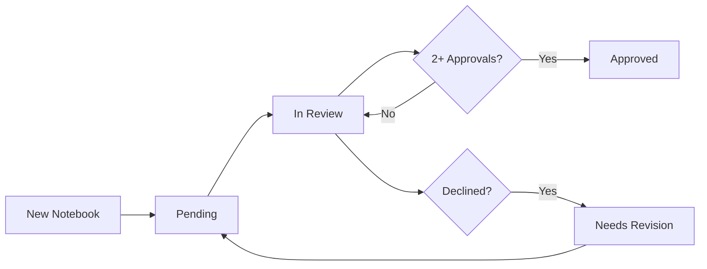

# 🔬 Peer Review Guidelines

## Overview

The Botanical Colabs project uses a **peer review system** to ensure scientific accuracy, methodological soundness, and code quality. Contributors can review notebooks and vote for approval or decline.

---

## 🏆 Review Badges

Notebooks display badges indicating their review status:

### Peer Review Badges


- **Meaning:** Notebook has been reviewed and approved by 2+ contributors
- **Criteria:** Scientific accuracy, methodology, and documentation verified


- **Meaning:** Notebook is currently under review
- **Number:** Shows current reviews / required reviews

### AI Generation Badges


- **Meaning:** Notebook was created or significantly assisted by AI
- **Purpose:** Transparency about AI involvement
- **Note:** AI-generated notebooks can still be peer-reviewed and approved

### Category Badges


- **Categories:** accuracy, methodology, documentation, usability, reproducibility
- **Meaning:** Specific aspects that have been reviewed and approved

---

## 📋 Review Categories

When reviewing a notebook, evaluate these categories:

### 1. Scientific Accuracy
- **Data sources** are authoritative (GBIF, Trefle, Wikipedia, etc.)
- **Taxonomic information** is correct
- **Results** are reproducible
- **Claims** are properly cited
- **Methodology** is scientifically sound

**Example approval:**
```json
{
  "category": "accuracy",
  "vote": "approve",
  "comment": "Data sources are authoritative, taxonomy verified against GBIF"
}
```

### 2. Methodology
- **Code** follows Python best practices
- **Error handling** is proper
- **Algorithms** are efficient
- **Rate limiting** respects API guidelines
- **Dependencies** are properly managed

**Example approval:**
```json
{
  "category": "methodology",
  "vote": "approve",
  "comment": "Proper error handling, efficient batch processing with rate limiting"
}
```

### 3. Documentation
- **Markdown cells** explain each step clearly
- **Code comments** are comprehensive
- **Data sources** are cited
- **Usage examples** are provided
- **API keys** and setup are documented

**Example approval:**
```json
{
  "category": "documentation",
  "vote": "approve",
  "comment": "Excellent documentation with step-by-step instructions"
}
```

### 4. Usability
- **Easy to run** in Google Colab
- **Clear instructions** for beginners
- **Interactive widgets** where appropriate
- **Error messages** are helpful
- **Results** are well-formatted

**Example approval:**
```json
{
  "category": "usability",
  "vote": "approve",
  "comment": "User-friendly interface with clear error messages"
}
```

### 5. Reproducibility
- **Results** can be reproduced
- **Dependencies** are pinned (where necessary)
- **Random seeds** are set (for ML notebooks)
- **Data sources** are stable
- **Instructions** are complete

**Example approval:**
```json
{
  "category": "reproducibility",
  "vote": "approve",
  "comment": "Successfully reproduced all results following the instructions"
}
```

---

## 🚀 How to Submit a Review

### Step 1: Test the Notebook

1. Open the notebook in Google Colab
2. Run all cells from top to bottom
3. Verify results are correct
4. Check for errors or warnings
5. Test with different inputs (if applicable)

### Step 2: Evaluate Categories

Review the notebook against the 5 categories:
- ✅ Scientific Accuracy
- ✅ Methodology
- ✅ Documentation
- ✅ Usability
- ✅ Reproducibility

### Step 3: Add Your Review

Edit `.github/peer-review.json`:

```json
{
  "notebooks": {
    "notebooks/examples/your-notebook.ipynb": {
      "reviews": [
        {
          "reviewer": "your-github-username",
          "date": "2025-11-05",
          "vote": "approve",
          "category": "accuracy",
          "comment": "Data sources verified, taxonomy correct, reproducible results"
        }
      ],
      "metadata": {
        "ai_generated": false,
        "peer_reviewed": false,
        "review_status": "in_review",
        "required_reviews": 2,
        "current_reviews": 1,
        "categories_approved": ["accuracy"]
      }
    }
  }
}
```

**Vote options:**
- `"approve"` — Notebook meets quality standards
- `"decline"` — Notebook needs significant improvements

### Step 4: Update Metadata

If this is the **2nd approval** (or reaches `required_reviews`), update metadata:

```json
"metadata": {
  "peer_reviewed": true,
  "review_status": "approved",
  "approval_date": "2025-11-05",
  "current_reviews": 2,
  "categories_approved": ["accuracy", "methodology"]
}
```

### Step 5: Commit and Push

```bash
git add .github/peer-review.json
git commit -m "review: approve notebook XYZ for accuracy and methodology"
git push origin main
```

---

## 🤖 Marking AI-Generated Notebooks

If a notebook was created or significantly assisted by AI:

### Step 1: Add AI Metadata

```json
"metadata": {
  "ai_generated": true,
  "ai_assistant": "GitHub Copilot",  // or "ChatGPT", "Claude", etc.
  "peer_reviewed": false,
  "review_status": "pending"
}
```

### Step 2: Document AI Usage

Add a cell at the beginning of the notebook:

```markdown
> **ℹ️ AI-Generated Content**
>
> This notebook was created with assistance from [AI Tool Name].
> It has been reviewed for scientific accuracy and functionality.
>
> 
```

### Step 3: Request Peer Review

AI-generated notebooks **require peer review** before approval:
- Follow the same review process
- Extra scrutiny on scientific accuracy
- Verify all data sources and citations

---

## 📊 Review Status Workflow



### Status Definitions

| Status | Meaning | Next Steps |
|--------|---------|------------|
| **pending** | Not yet reviewed | Request review with PR label `peer-review-request` |
| **in_review** | 1+ review submitted | Need more reviews to reach required count |
| **approved** | 2+ reviews, all approve | Notebook is verified ✅ |
| **declined** | Review(s) declined | Address feedback and resubmit |

---

## 🎯 Review Requirements

### Minimum Reviews

- **Templates:** 2 reviews required
- **Examples:** 2 reviews required
- **Educational:** 1 review required
- **Regional:** 1 review required (preferably local expert)

### Reviewer Qualifications

Reviewers should have:
- Background in botany, ecology, or related field **OR**
- Experience with Python data science **OR**
- Expertise in the specific notebook topic

### Conflicts of Interest

**Cannot review:**
- Your own notebooks
- Notebooks you co-authored
- Notebooks from collaborators on the same project

---

## 🔄 Re-review Requirements

Notebooks need re-review if:

1. **Major changes** to methodology or data sources
2. **API updates** that affect results
3. **Dependencies** change significantly
4. **More than 1 year** since last review

Re-review process:
- Existing reviews remain visible
- New reviews added to the list
- Status updated when re-review threshold met

---

## 📝 Review Template

Use this template when adding reviews:

```json
{
  "reviewer": "your-github-username",
  "date": "YYYY-MM-DD",
  "vote": "approve | decline",
  "category": "accuracy | methodology | documentation | usability | reproducibility",
  "comment": "Detailed feedback (required, min 20 characters)"
}
```

**Good review comments:**
- ✅ "Data sources verified against GBIF API documentation, taxonomy is correct"
- ✅ "Tested with 50+ species, all results reproducible"
- ✅ "Error handling is robust, code follows PEP 8 standards"

**Poor review comments:**
- ❌ "Looks good" (too vague)
- ❌ "LGTM" (no detail)
- ❌ "Approved" (doesn't explain what was checked)

---

## 🏅 Reviewer Recognition

Contributors who submit quality reviews earn recognition:

### Review Count Badges

- 🥉 **Bronze Reviewer:** 5+ reviews
- 🥈 **Silver Reviewer:** 15+ reviews
- 🥇 **Gold Reviewer:** 30+ reviews

### Expert Reviewers

Specialized expertise badges:
- 🌿 **Botany Expert**
- 🔬 **Scientific Methods Expert**
- 💻 **Code Quality Expert**
- 📊 **Data Science Expert**

---

## 📧 Getting Help

Questions about the review process?

- **GitHub Discussions:** [Ask a question](https://github.com/outobecca/botanical-colabs/discussions)
- **Issues:** [Report problems](https://github.com/outobecca/botanical-colabs/issues)
- **Email:** Contact maintainers

---

## 📜 Review Ethics

### Principles

1. **Constructive:** Feedback should help improve notebooks
2. **Respectful:** Critique the work, not the person
3. **Thorough:** Test thoroughly before approving
4. **Honest:** Only approve what meets standards
5. **Timely:** Respond to review requests within 2 weeks

### Unacceptable Practices

- ❌ Approving without testing
- ❌ Personal attacks in comments
- ❌ Reviewing your own work
- ❌ Quid pro quo review exchanges
- ❌ Ignoring scientific errors

---

## 🔧 Automated Checks

GitHub Actions automatically:

1. **Validates** peer-review.json syntax
2. **Posts** review status on PRs
3. **Generates** badge documentation
4. **Updates** notebook status
5. **Notifies** contributors

---

**Last Updated:** 2025-11-05  
**Version:** 1.0  
**Maintained by:** Botanical Colabs Community

[← Back to Contributing](CONTRIBUTING.md) | [View Reviews](NOTEBOOK_REVIEWS.md) | [See Workflow](.github/workflows/peer-review.yml)
