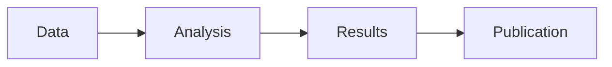

# 🎤 Marp Presentation Template

[](https://colab.research.google.com/github/outobecca/botanical-colabs/blob/main/notebooks/templates/TEMPLATE_marp_presentation.ipynb)

> **Convert your botanical research into beautiful presentations with Marp**

---

## 📋 Overview

The Marp Presentation Template transforms Jupyter notebooks into professional slide decks. Perfect for:
- 🎓 **Conference presentations**
- 👨‍🏫 **Teaching materials**
- 💼 **Stakeholder updates**
- 📊 **Research demos**
- 🌐 **Webinars**

Export to **HTML**, **PDF**, or **PowerPoint** with a single command!

---

## 🎯 Use Cases

### Academia
- ✅ Conference talks (AGU, ESA, botanical symposia)
- ✅ Thesis defenses
- ✅ Lab meetings
- ✅ Poster presentations (extended version)
- ✅ Grant proposals

### Education
- ✅ Lecture slides
- ✅ Tutorial materials
- ✅ Workshop presentations
- ✅ Student projects
- ✅ Online courses

### Professional
- ✅ Client presentations
- ✅ Team updates
- ✅ Stakeholder reports
- ✅ Research demos
- ✅ Product launches

---

## ⭐ Key Features

### Marp Markdown

#### Slide Breaks
```markdown
# First Slide

Content here

---

# Second Slide

More content
```

#### Themes
```markdown
---
marp: true
theme: default  # or gaia, uncover
---
```

**Available themes:**
- `default` — Clean and professional
- `gaia` — Modern with gradients
- `uncover` — Minimalist centered

#### Custom Styling
```markdown
---
marp: true
style: |
  section {
    background-color: #2e7d32;
    color: white;
  }
---
```

### Background Images

#### Full Background
```markdown

```

#### Split Background
```markdown


Content on left side
```

#### Transparent Overlay
```markdown


Content over transparent background
```

### Slide Classes

#### Title Slides
```markdown
<!-- _class: lead -->
# Big Centered Title
```

#### Dark Theme
```markdown
<!-- _class: invert -->
# Dark Background
```

#### Combined
```markdown
<!-- _class: lead invert -->
# Big Dark Centered
```

### Headers & Footers

```markdown
---
header: 'Your Header Text'
footer: '© 2025 Your Name'
paginate: true
---
```

---

## 📦 What's Included

### Slide Structure

1. **Title Slide** — Project introduction with background image
2. **Overview** — Agenda and learning objectives (grid layout)
3. **Research Question** — Big centered statement
4. **Data Sources** — Table of APIs and coverage
5. **Methodology** — Mermaid diagram workflow
6. **Live Demo** — Interactive code execution
7. **Data Analysis** — Real code with sample data
8. **Visualizations** — Matplotlib/Seaborn charts
9. **Key Findings** — Grid cards with insights
10. **Scientific Insights** — Blockquotes with discoveries
11. **Conclusions** — Summary slide
12. **Q&A** — Contact information
13. **References** — Data source citations
14. **Appendix** — Technical details
15. **Export Instructions** — How to convert to slides

### Code Features

- ✅ Auto-reload enabled
- ✅ Presentation-friendly plotting style
- ✅ Large fonts for readability
- ✅ Sample data generation
- ✅ Professional visualizations
- ✅ Live code execution

---

## 🚀 Getting Started

### 1. Open in Colab
Click the "Open in Colab" badge above

### 2. Edit Content
Modify markdown cells with your content:
- Change titles and headers
- Update data and code
- Add your images
- Customize styling

### 3. Run Code Cells
Execute code cells for live demos during presentation

### 4. Export Slides
Choose your format and export (see below)

---

## 📤 Export Options

### Option 1: Marp CLI (Recommended)

**Install:**
```bash
npm install -g @marp-team/marp-cli
```

**Export to HTML:**
```bash
marp presentation.md -o slides.html
```

**Export to PDF:**
```bash
marp presentation.md --pdf -o slides.pdf
```

**Export to PowerPoint:**
```bash
marp presentation.md --pptx -o slides.pptx
```

**Watch mode (auto-rebuild):**
```bash
marp presentation.md -w
```

### Option 2: VS Code Extension

1. Install "Marp for VS Code" extension
2. Open Command Palette (Ctrl/Cmd+Shift+P)
3. Search "Marp: Export slide deck"
4. Choose format

### Option 3: Jupyter RISE

**Install:**
```bash
pip install RISE
```

**Use:**
1. In Jupyter: View → Cell Toolbar → Slideshow
2. Configure each cell type
3. Click presentation icon

---

## 🎨 Customization

### Themes

#### Default Theme
```markdown
---
marp: true
theme: default
---
```
Clean, professional, perfect for most presentations

#### Gaia Theme
```markdown
---
marp: true
theme: gaia
---
```
Modern with gradients, great for creative talks

#### Uncover Theme
```markdown
---
marp: true
theme: uncover
---
```
Minimalist centered, ideal for keynotes

### Custom Colors

```markdown
---
marp: true
style: |
  section {
    background: linear-gradient(135deg, #667eea 0%, #764ba2 100%);
    color: white;
  }
  h1 {
    color: #ffd700;
    text-shadow: 2px 2px 4px rgba(0,0,0,0.5);
  }
---
```

### Fonts

```markdown
---
marp: true
style: |
  @import url('https://fonts.googleapis.com/css2?family=Roboto:wght@400;700&display=swap');
  section {
    font-family: 'Roboto', sans-serif;
  }
---
```

### Backgrounds

**Solid color:**
```markdown
<!-- _backgroundColor: #2e7d32 -->
```

**Gradient:**
```markdown
<!-- _backgroundImage: linear-gradient(to right, #4facfe 0%, #00f2fe 100%) -->
```

**Image with positioning:**
```markdown


```

---

## 💡 Tips & Best Practices

### Content

- ✅ **One idea per slide** — Keep it simple
- ✅ **Large fonts** — Minimum 24pt for readability
- ✅ **Limited text** — Use bullet points
- ✅ **Visual hierarchy** — Clear headers
- ✅ **Consistent style** — Same theme throughout

### Images

- ✅ **High resolution** — At least 1920×1080
- ✅ **Relevant** — Support your message
- ✅ **Properly licensed** — Check usage rights
- ✅ **Optimized** — Compress for web
- ✅ **Alt text** — Accessibility

### Code

- ✅ **Syntax highlighting** — Use code blocks
- ✅ **Large fonts** — Readable from back row
- ✅ **Minimal code** — Show key parts only
- ✅ **Live demos** — Run during presentation
- ✅ **Error handling** — Have backups

### Presenting

- ✅ **Practice** — Rehearse timing
- ✅ **Backup** — PDF version ready
- ✅ **Test equipment** — Check beforehand
- ✅ **Presenter notes** — Use speaker view
- ✅ **Questions** — Prepare for Q&A

---

## 📊 Sample Presentation Structure

### Standard Conference Talk (15-20 min)

1. **Title Slide** (30s)
   - Title, author, affiliation
   - Eye-catching background

2. **Overview** (1 min)
   - Outline of talk
   - Key takeaways

3. **Introduction** (2-3 min)
   - Problem statement
   - Research question
   - Why it matters

4. **Methods** (3-4 min)
   - Study design
   - Data sources
   - Analysis approach

5. **Results** (5-7 min)
   - Key findings
   - Visualizations
   - Live demos

6. **Discussion** (2-3 min)
   - Interpretation
   - Limitations
   - Future work

7. **Conclusions** (1 min)
   - Main takeaways
   - Call to action

8. **Q&A** (5 min)
   - Contact info
   - References

### Teaching Lecture (45-60 min)

- More slides allowed
- Interactive elements
- Practice problems
- Discussion prompts
- Recap slides every 10 min

---

## 🔧 Advanced Features

### Mermaid Diagrams

```markdown

```

### Math Equations

```markdown
Inline: $E = mc^2$

Display:
$$
\int_0^\infty e^{-x^2} dx = \frac{\sqrt{\pi}}{2}
$$
```

### Tables

```markdown
| Species | Occurrences | Countries |
|---------|-------------|-----------|
| Rosa canina | 8,732 | 47 |
| Pinus sylvestris | 9,421 | 52 |
```

### Fragments

Show content incrementally:

```markdown
* Item 1
* Item 2 <!-- .element: class="fragment" -->
* Item 3 <!-- .element: class="fragment" -->
```

### Speaker Notes

```markdown
<!-- 
Speaker notes here
Not visible to audience
Visible in presenter view
-->
```

---

## 📱 Responsive Design

### Mobile-Friendly

Marp slides adapt to different screen sizes:
- Desktop presentations
- Tablet viewing
- Mobile access

### PDF Export

Best for:
- Sharing via email
- Printing handouts
- Archiving
- Universal compatibility

### HTML Export

Best for:
- Interactive elements
- Online sharing
- Embedding in websites
- Live code demos

---

## 🎓 Learning Resources

### Marp Documentation
- [Official Marp Website](https://marp.app)
- [Marp CLI Docs](https://github.com/marp-team/marp-cli)
- [Marpit Framework](https://marpit.marp.app)

### Examples
- [Marp Core Examples](https://github.com/marp-team/marp-core/tree/main/examples)
- [Community Presentations](https://github.com/topics/marp)

### Design Resources
- [Unsplash](https://unsplash.com) — Free images
- [Google Fonts](https://fonts.google.com) — Web fonts
- [Coolors](https://coolors.co) — Color palettes

---

## 🆚 Comparison with Alternatives

| Feature | Marp | PowerPoint | Reveal.js | Google Slides |
|---------|------|------------|-----------|---------------|
| Markdown | ✅ Yes | ❌ No | ⚠️ Limited | ❌ No |
| Version Control | ✅ Easy | ❌ Hard | ✅ Easy | ❌ Hard |
| Code Blocks | ✅ Native | ⚠️ Manual | ✅ Native | ⚠️ Manual |
| Export Options | ✅ Many | ✅ Many | ⚠️ Limited | ⚠️ Limited |
| Offline | ✅ Yes | ✅ Yes | ⚠️ Partial | ❌ No |
| Learning Curve | ✅ Low | ✅ Low | ⚠️ Medium | ✅ Low |
| Customization | ✅ Full CSS | ⚠️ Limited | ✅ Full | ⚠️ Limited |
| **Best for** | Developers | Business | Web devs | Quick sharing |

---

## 🐛 Troubleshooting

### Common Issues

**Marp not exporting:**
- Check Marp CLI is installed: `marp --version`
- Verify frontmatter: `marp: true`
- Check file extension: `.md`

**Images not showing:**
- Use absolute or relative paths
- Verify image files exist
- Check file permissions

**Syntax not rendering:**
- Ensure proper Markdown syntax
- Check for unclosed fences
- Validate YAML frontmatter

**PDF export fails:**
- Install Chrome/Chromium
- Check file permissions
- Verify output path exists

---

## 📊 Example Presentations

### Research Talk
- **Duration:** 20 minutes
- **Slides:** 25-30
- **Focus:** Results and methodology
- **Style:** Professional, data-driven

### Educational Lecture
- **Duration:** 50 minutes
- **Slides:** 40-50
- **Focus:** Concepts and examples
- **Style:** Engaging, interactive

### Lightning Talk
- **Duration:** 5 minutes
- **Slides:** 10-12
- **Focus:** One key message
- **Style:** Bold, minimalist

### Workshop Tutorial
- **Duration:** 90 minutes
- **Slides:** 30-40 (+ demos)
- **Focus:** Hands-on learning
- **Style:** Step-by-step, practical

---

## 📄 License

MIT License — Free to use, modify, and distribute

**Citation:**
```bibtex
@software{botanical_marp_template_2025,
  author = {Sihvonen, Pekka},
  title = {Marp Presentation Template - Botanical Colabs},
  year = {2025},
  publisher = {GitHub},
  url = {https://github.com/outobecca/botanical-colabs}
}
```

---

## 🤝 Contributing

Share your presentations or improvements!

- 🎨 [Share Your Slides](https://github.com/outobecca/botanical-colabs/discussions)
- 🐛 [Report Issue](https://github.com/outobecca/botanical-colabs/issues/new)
- 🔀 [Submit Pull Request](https://github.com/outobecca/botanical-colabs/pulls)

---

## 🌟 Gallery

Want to see your presentation featured here? Share it in [Discussions](https://github.com/outobecca/botanical-colabs/discussions)!

---

**Created:** 2025-11-04  
**Version:** 2.0  
**Status:** ✅ Production Ready

[← Back to Templates](Home#-templates) | [View on GitHub](https://github.com/outobecca/botanical-colabs/blob/main/notebooks/templates/TEMPLATE_marp_presentation.ipynb)
